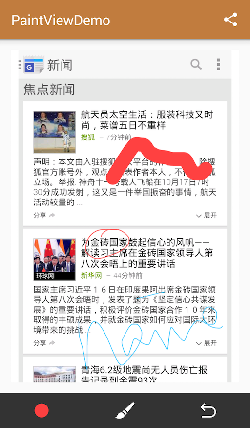

# PaintView

涂鸦控件，点击下方ICON下载Demo。

截图如下

## Version

### 1.0.0

* 设置背景图
* 设置画笔颜色、宽度
* 撤销
* 获取涂鸦后Bitmap

## TODO

* 橡皮擦

## Demo

* 从网页截图作为背景图
* 涂鸦后分享
* 截图后Bitmap理论上可以通过Intent传递，但图片过大会导致崩溃，因此Demo中使用静态存储传递